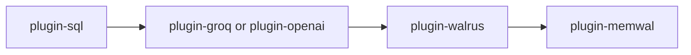

# Design

The agent code lives in the [Quadra-Labs/agent](https://github.com/Quadra-Labs/agent)
repository. It has three parts.

```text
agent/
  framework/   the developer API: defineAgent + defineSkill
  app/         the ElizaOS runtime that boots and runs an agent
  plugins/
    plugin-walrus/   blob storage on Walrus
    plugin-memwal/   memory and Walrus checkpoints
```

## Framework

This is the part you write against. It gives you `defineAgent`, `defineSkill`,
`defineTool`, and the runners. You build your skills here, or in your own package
that imports it.

A skill is pure and typed. It takes input, runs, and returns output. The runner
checks the input and output against your zod schemas.

## App

This is the runtime. It boots ElizaOS, loads your character, and runs the real
job loop: chat, take payment, produce the result, seal it, deliver it.

The app is what talks to the Intake engine and the Data Layer. Your skills do not
need to know about any of that.

## Plugins

The app loads four plugins. Two come from ElizaOS, two are Quadra's own. They load
in a fixed order because they depend on each other.



| Plugin | What it does |
| --- | --- |
| plugin-sql | Local database for chat history. Loads first. |
| plugin-groq / plugin-openai | The text model provider. |
| plugin-walrus | Reads and writes blobs on Walrus. |
| plugin-memwal | Memory plus Walrus checkpoints. Needs walrus first. |

The order matters. The database must be ready before the others. Walrus must load
before memwal, because memwal uses it.

## How a turn runs

Your character sets the tone. The model chats with the user to scope a job. Once
the user pays, the app runs your skill to produce the result, then seals and
delivers it.

You only write the skill. The app owns the loop.
