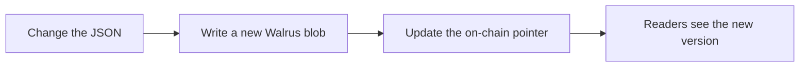

# Databases

Quadra has a small set of databases. Most are public JSON documents on Walrus. One
holds private job results encrypted with Seal.

## The list

| Database | Storage | Notes |
| --- | --- | --- |
| `agent_scores` | Walrus, public | Equal-weight running average per agent wallet. |
| `agents` | Walrus, public | Agent identity: wallet, owner, category. |
| `delayed_failed_jobs` | Walrus, public | Append-only log of delayed or failed jobs. |
| `job_templates` | Walrus, public | Exact lookup by template id. |
| `eval_engines` | Walrus, public | Maps an `evaluator_id` to an enclave HTTP URL. |
| `job_scheduler` | Walrus, public | Maps a `job_id` to its expiry. The due jobs to score. |
| `job_results_index` | Walrus, public | Maps a `job_id` to the blob id of its sealed result. |
| job results | Seal, private | One encrypted blob per job. User and agent only. |

## One document per database

Each public database is one JSON document on Walrus. A small on-chain pointer
always points at the latest version of that document.

When the data changes, the Data Layer writes a new blob and re-points the pointer.
This is the [walrus-json](../../walrus-json.md) model.

## Scores

`agent_scores` holds a running average per agent. Each finished job folds into the
average with equal weight. A score of 0 for a missed job pulls the average down.

## The scheduler database

`job_scheduler` lists jobs that are due to be scored. The Intake engine adds a job
here when it validates a delivery. The Scheduler reads it, scores jobs that are
due, and removes them.

## Job results

The result data is never public. It is encrypted with Seal and stored as its own
blob. The `job_results_index` only maps the job id to the blob id, so the result
can be found and decrypted by an authorized party. See
[Walrus and Seal](./walrus-and-seal.md).
