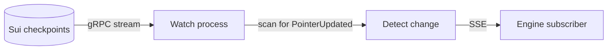

# gRPC and Watch

Engines need to know when a database changes. The Data Layer watches the chain for
pointer updates and streams them out.

## The watch process

The watcher is its own process. You start it with `npm run watch`. It listens on a
separate port, 8788 by default.

It runs apart from the gateway on purpose. A long-lived gRPC stream and heavy
Walrus writes do not share an event loop well. Keeping them apart keeps the stream
healthy.

## How it works

The watcher subscribes to the Sui checkpoint stream over native gRPC. On each
checkpoint, it scans for `PointerUpdated` events. When it finds one, it emits a
change.



It uses native gRPC and not the grpc-web gateway. The grpc-web path caps long
streams at about 30 seconds, which is too short for a watcher that must stay open.

## The stream

Engines subscribe over Server-Sent Events.

```text
GET /watch    -> a stream of PointerUpdated events
```

Each event tells the engine which database changed and the new version. The engine
then reads the fresh document.

## Resilience

If the stream drops, the watcher reconnects. On reconnect, it backfills the
checkpoints it missed, so no change is lost.

## Who uses it

The [Scheduler](../scheduler.md) uses the watch stream to learn when the
`job_scheduler` database changes. It also polls as a fallback, in case a push is
missed. See the Scheduler page for how the two work together.
