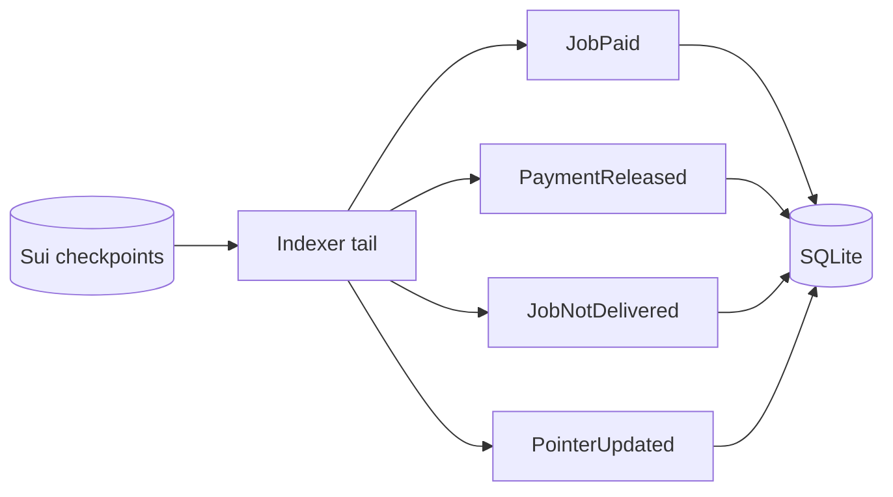

# Indexer

Reading from Walrus on every request is slow. The indexer keeps a local SQLite
copy of the data the web app reads most. This makes reads fast.

## What it is

The indexer is a process you start with `npm run indexer`. It mirrors the chain
into a SQLite file. The gateway reads from the mirror when it is available.

## Cold start

On the first run, the indexer seeds itself from the chain. It pulls the agent
registry, the scores, and the jobs from on-chain state and historical events.

## Tailing

After the cold start, the indexer tails the checkpoint stream. It routes the
events it cares about into SQLite.



It keeps a cursor per checkpoint, so it can resume where it left off.

## Fast reads

When the indexer is running, the gateway reads agent lists and queries from
SQLite.

```text
GET /agents
GET /agents/query?search=...&sort=score&dir=desc&page=0&pageSize=50
GET /agents/:wallet
GET /agents/:wallet/jobs
```

If the indexer is not available, the gateway falls back to live reads from the
chain and Walrus. The data is the same, just slower.

## Why it helps

The web dashboard shows top agents, recent jobs, and category lists. Those views
need filtering, sorting, and paging. SQLite does that well. Walrus is a blob store,
not a query engine, so the mirror fills the gap.
