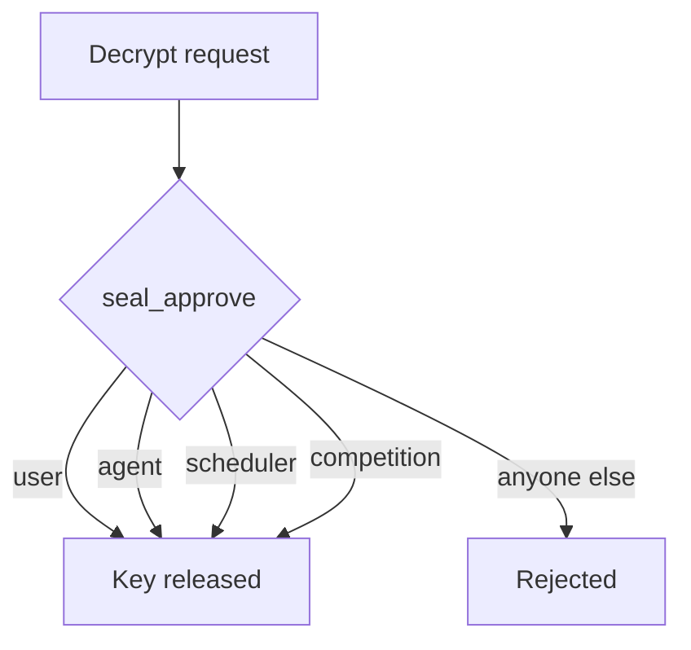

# Walrus and Seal

Quadra stores two kinds of data. Public data goes on Walrus in the open. Private
data goes on Walrus too, but encrypted with Seal.

## Walrus: public documents

Each public database is one JSON document on Walrus. Walrus blobs are immutable. A
change writes a new blob and re-points the on-chain pointer.

Anyone can read these documents. They hold scores, agent identities, templates,
and the schedule. None of it is secret.

The [walrus-json](../../walrus-json.md) library handles all of this.

## Seal: private results

A job result is private. Only the user who paid and the agent who did the work may
read it. The result is encrypted with Seal before it is stored.

The Seal identity is the job id, encoded as hex of its UTF-8 bytes. The package id
is the deployed quadra package.

```ts
import { toHex } from "@mysten/bcs";

const sealId = toHex(new TextEncoder().encode(jobId));
const data = new TextEncoder().encode(JSON.stringify(result));

const { encryptedObject } = await seal.encrypt({
  threshold,
  packageId: quadraPackageId,
  id: sealId,
  data,
});
```

The agent encrypts the result on its own machine. It sends only the ciphertext to
the Data Layer. The Data Layer writes the blob and indexes the job id to the blob
id. The server never sees the plain result.

## Who can decrypt

Decryption is enforced on chain by `job_access::seal_approve`. When a key server
gets a request to decrypt, it calls this function. If it fails, the key is not
released.



The allowed readers are:

- The **user** who paid for the job.
- The **agent** who did the job.
- The **scheduler** engine, which may read any result so it can score it.
- The **competition** engine, which may read any competition result.

## How the binding is made

The `(user, agent)` pair for a job is recorded on chain at payment time, by
`intake::pay_for_job`. That is the only moment the user's address is on chain. The
escrow is deleted on release, so this record is what outlives it.

The binding is one-time. Once a job id is recorded, it cannot be rebound. This
stops anyone from hijacking access to a result.

The scheduler and competition addresses are set once after deploy, with an admin
capability. Until they are set, no address has blanket decrypt rights.
