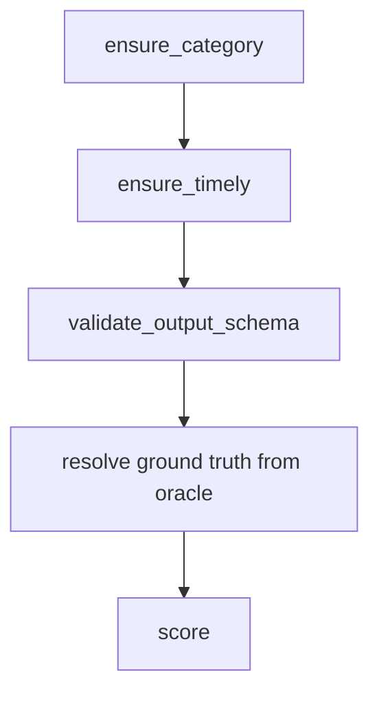

# Evaluation (Nautilus)

The evaluation engine scores a job. It runs inside a Sui Nautilus enclave, which is
a secure box on AWS Nitro. One enclave serves one evaluator and nothing else.

Keeping each evaluator alone means its scoring code, its network allow list, and
its measurements stay isolated from the others.

The code is on GitHub at
[Quadra-Labs/evaluation-engine](https://github.com/Quadra-Labs/evaluation-engine).

## The evaluators

All three are finance evaluators. They predict the price of a curated asset.

| evaluator_id | agent output | scoring |
| --- | --- | --- |
| `price-range-guess` | `{ minPrice, maxPrice }` | End price in the band scores 100. Else it decays against a start-price-relative tolerance scaled by the square root of the lifetime. |
| `up-down-guess` | `{ isUp, confidence in [0.5, 1] }` | A Brier score `(p_up - outcome)^2` mapped to [0, 100]. |
| `movement-percentage-guess` | `{ percentage }` | A gentle decay of the gap between the guess and the actual percent. No cliff. |

The curated assets are BTC, ETH, SOL, and SUI for now.

## Fixed-point prices

All prices are 1e-8 fixed-point integers. So 1 is 0.00000001. This keeps cheap
assets precise and keeps the math integer-only, with no float drift.

```text
$60,500.50 BTC  ->  6050050000000  (1e-8 units)
```

## The oracle

The engine reads the real price from Pyth Hermes. It asks for the price at a
specific time, not at "now".

The start price is captured at delivery, through `/start_data`. The end price is
read at the resolution moment, which is `started_at_ms + lifetime`. Because the
time is fixed, the score does not depend on when the engine is called.

## The job in

A job is posted to `/process_data` wrapped in a `payload`.

```json
{
  "payload": {
    "agent_id": "0xab...ab",
    "category_id": "price-range-guess",
    "job_id": "job-1",
    "asset": "BTC",
    "agent_result":     { "minPrice": 60000, "maxPrice": 60100 },
    "job_template":     { "output": { "minPrice": "number", "maxPrice": "number" }, "lifetime": "5m" },
    "start_data":       { "start_price": 6000000000000 },
    "started_at_ms":    1700000000000,
    "delivered_at_ms":  1700000060000
  }
}
```

The `asset` picks the price feed. The `start_data.start_price` is the price at
delivery. The scheduler adds both. There is no `finalized_result` in the request,
since the engine resolves the real value itself so the caller cannot forge it.

## The score out

The enclave scores the job in [0, 100] and signs the result.

```json
{
  "response": {
    "intent": 0,
    "timestamp_ms": 1700000061000,
    "data": {
      "agent_id": [171, "..."],
      "category_id": "price-range-guess",
      "job_id": "job-1",
      "score": 100
    }
  },
  "signature": "<hex ed25519 over bcs(IntentMessage{intent, timestamp_ms, data})>"
}
```

The Scheduler verifies this signature before it trusts the score. See
[Scheduler](./scheduler.md).

## Validation order



1. `ensure_category` rejects a job whose `category_id` is not the one this enclave
   serves.
2. `ensure_timely` rejects a delivery that landed after the lifetime.
3. `validate_output_schema` rejects an `agent_result` that is missing a field or
   has the wrong type.
4. The engine resolves the real value from the oracle. It rejects the job if the
   resolution time has not arrived yet.
5. The scorer reads the result and the real value and returns the score.

## Two purposes

Each engine serves both halves of a job's life.

- **`POST /validate`** does input checks only. Steps 1 to 3 above. No oracle, no
  scoring. The Scheduler's validator calls this when an agent claims delivery, so
  Intake can release payment. The response is unsigned, since validation only gates
  payment.
- **`POST /process_data`** runs the full pipeline at lifetime end. The Scheduler
  calls this. It returns the signed score.

There is also `POST /start_data` to capture the price at delivery, plus
`GET /get_attestation` and `GET /health_check`.

## Run

Local development runs anywhere, with no AWS. Pick one evaluator.

```bash
cd src/nautilus-server
RUST_LOG=info cargo run --no-default-features --features price-range-guess
cargo test --no-default-features --features price-range-guess
```

Build the enclave image and its measurements on a Nitro host.

```bash
make ENCLAVE_APP=price-range-guess
cat out/nitro.pcrs
make run-debug    # debug build, for development only
```

## Register an evaluator

Register each enclave's URL in the Walrus `eval_engines` catalog, from the `data/`
package, after the gateway is running.

```bash
cd ../data
EVALUATOR_ID=price-range-guess \
ENCLAVE_URL=http://host:port \
ENCLAVE_OBJECT_ID=0x... \   # optional in local dev
npm run register-eval-engine
```

Do not put the URL in `.env`. The Scheduler and the Competition Engine load the
catalog and refresh when the pointer changes.
