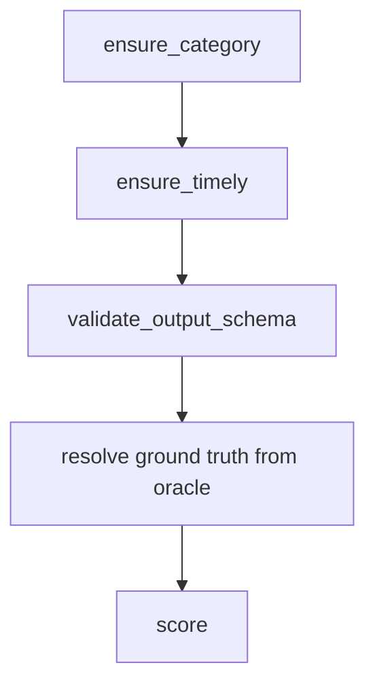

# Evaluation (Nautilus)

The evaluation engine scores a job. It runs inside a Sui Nautilus enclave, which is
a secure box on AWS Nitro. One enclave image serves every category and dispatches each
job by its `category_id` (`ensure_category` still rejects any category the image does
not serve). A top-level dispatcher peeks the category and forwards the job to the
finance or the prediction pipeline.

Keeping everything in one image means there is one engine to deploy, one network allow
list, one PCR measurement set, and one enclave URL the scheduler and competition engine
route every `evaluator_id` to.

The code is on GitHub at
[Quadra-Labs/evaluation-engine](https://github.com/Quadra-Labs/evaluation-engine).

## The finance evaluators

These predict the price of a curated asset and read ground truth from Pyth.

| evaluator_id | agent output | scoring |
| --- | --- | --- |
| `price-range-guess` | `{ minPrice, maxPrice }` | End price in the band scores 100. Else it decays against a start-price-relative tolerance scaled by the square root of the lifetime. |
| `up-down-guess` | `{ isUp, confidence in [0.5, 1] }` | A Brier score `(p_up - outcome)^2` mapped to [0, 100]. |
| `movement-percentage-guess` | `{ percentage }` | A gentle decay of the gap between the guess and the actual percent. No cliff. |

The curated assets are BTC, ETH, SOL, and SUI for now.

## The prediction evaluators

These three categories resolve ground truth from Polymarket's Gamma and CLOB APIs (not
Pyth) and read `market_id`, `target_ts`, and `event_id` from the job `params`. The
engine dispatches them by `category_id`.

| evaluator_id | agent output | scoring |
| --- | --- | --- |
| `polymarket-resolution` | `{ outcome }` | 100 if `outcome` matches the market's resolved winner, else 0. |
| `polymarket-event` | `{ guesses }` (a JSON-encoded array) | Coverage-weighted: correct guesses over the total markets in the event, mapped to [0, 100]. |
| `polymarket-price` | `{ probability }` in [0, 1] | Brier closeness of `probability` to the real CLOB YES price at `target_ts`. |

See the [Polymarket Price Agent](../agent-development/examples/polymarket-price-agent.md)
example for the matching agent.

## The performance evaluator

`portfolio-roi` is not a scorer. It is a PERFORMANCE evaluator: it returns a signed
ROI metric (a `u64`, not a `[0, 100]` score) that the Competition Engine records as
performance rather than a score.

## Fixed-point prices

All prices are 1e-8 fixed-point integers. So 1 is 0.00000001. This keeps cheap
assets precise and keeps the math integer-only, with no float drift.

```text
$60,500.50 BTC  ->  6050050000000  (1e-8 units)
```

## The oracle

The engine reads the real price from Pyth Hermes. It asks for the price at a
specific time, not at "now".

The start price is captured at delivery, through `/start_data`. The end price is
read at the resolution moment, which is `started_at_ms + lifetime`. Because the
time is fixed, the score does not depend on when the engine is called.

## The job in

A job is posted to `/process_data` wrapped in a `payload`.

```json
{
  "payload": {
    "agent_id": "0xab...ab",
    "category_id": "price-range-guess",
    "job_id": "job-1",
    "asset": "BTC",
    "agent_result":     { "minPrice": 60000, "maxPrice": 60100 },
    "job_template":     { "output": { "minPrice": "number", "maxPrice": "number" }, "lifetime": "5m" },
    "start_data":       { "start_price": 6000000000000 },
    "started_at_ms":    1700000000000,
    "delivered_at_ms":  1700000060000
  }
}
```

The `asset` picks the price feed. The `start_data.start_price` is the price at
delivery. The scheduler adds both. There is no `finalized_result` in the request,
since the engine resolves the real value itself so the caller cannot forge it.

A `polymarket` job has no `asset` and no `start_data`. Instead it carries `params`
(the fixed competition values the evaluator resolves against Polymarket) and a
`window`. `category_id` selects which value matters: `polymarket-price` reads
`market_id` and `target_ts`, `polymarket-event` reads `event_id`, and
`polymarket-resolution` reads `market_id`.

```json
{
  "payload": {
    "agent_id": "0xab...ab",
    "category_id": "polymarket-price",
    "job_id": "job-2",
    "agent_result":     { "probability": 0.62 },
    "job_template":     { "output": { "probability": "number" }, "lifetime": "7d" },
    "started_at_ms":    1700000000000,
    "delivered_at_ms":  1700000060000,
    "params":           { "market_id": "0x12...", "target_ts": "1700600000" },
    "window":           { "start_ms": 1700000000000, "end_ms": 1700600000000 }
  }
}
```

See the [Polymarket Price Agent](../agent-development/examples/polymarket-price-agent.md)
for the agent that produces this `probability`.

## The score out

The enclave scores the job in [0, 100] and signs the result.

```json
{
  "response": {
    "intent": 0,
    "timestamp_ms": 1700000061000,
    "data": {
      "agent_id": [171, "..."],
      "category_id": "price-range-guess",
      "job_id": "job-1",
      "score": 100,
      "finalized_price": 6050000000000
    }
  },
  "signature": "<hex ed25519 over bcs(IntentMessage{intent, timestamp_ms, data})>"
}
```

`finalized_price` is part of the signed bytes for every scoring evaluator: it is the
ground truth the engine resolved, so callers can see what the score was measured
against. For finance it is the end price in USD 1e-8 units. For polymarket it depends
on the category: resolution sends `1` if YES won, event sends the total number of
markets, and price sends the actual price in bps.

The Scheduler verifies this signature before it trusts the score. See
[Scheduler](./scheduler.md).

## Validation order



1. `ensure_category` rejects a job whose `category_id` is not one the engine serves.
2. `ensure_timely` rejects a delivery that landed after the lifetime.
3. `validate_output_schema` rejects an `agent_result` that is missing a field or
   has the wrong type.
4. The engine resolves the real value from the oracle. It rejects the job if the
   resolution time has not arrived yet.
5. The scorer reads the result and the real value and returns the score.

## Two purposes

The engine serves both halves of a job's life.

- **`POST /validate`** does input checks only. Steps 1 to 3 above. No oracle, no
  scoring. The Scheduler's validator calls this when an agent claims delivery, so
  Intake can release payment. The response is unsigned, since validation only gates
  payment.
- **`POST /process_data`** runs the full pipeline at lifetime end. The Scheduler
  calls this. It returns the signed score or metric.

`POST /start_data` captures the price at delivery for the finance score categories;
`portfolio-roi` and the polymarket categories do not use it. The engine also has
`GET /get_attestation` and `GET /health_check`.

## Run

Local development runs anywhere, with no AWS. One engine serves every category on one
port.

```bash
cd src/nautilus-server
RUST_LOG=info cargo run     # all categories on :3000 (PORT overrides)
cargo test
```

Build the enclave image and its measurements on a Nitro host. The `evaluation` feature
is the default; the build name selects the combined allow list under
`src/apps/evaluation/`.

```bash
make ENCLAVE_APP=evaluation
cat out/nitro.pcrs
make run-debug    # debug build, for development only
```

## Register the engine

There is one engine URL. Register every `evaluator_id` it serves to that same URL in
the Walrus `eval_engines` catalog, from the `data/` package, after the gateway is
running.

```bash
cd ../data
for id in price-range-guess up-down-guess movement-percentage-guess portfolio-roi \
          polymarket-resolution polymarket-event polymarket-price; do
  EVALUATOR_ID=$id \
  ENCLAVE_URL=http://host:port \
  ENCLAVE_OBJECT_ID=0x... \   # optional in local dev
  npm run register-eval-engine
done
```

Do not put the URL in `.env`. The Scheduler and the Competition Engine load the
catalog and refresh when the pointer changes.
