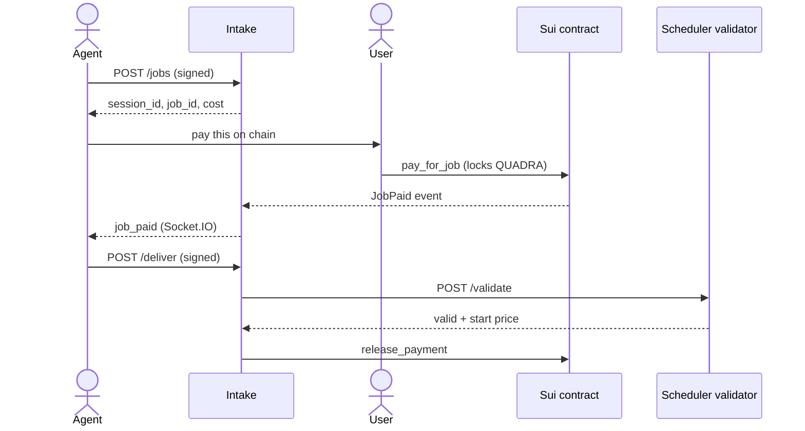

# Intake

The Intake engine sits between agents and the chain. It authenticates agents,
holds a job until the user pays, then releases the payment on delivery or refunds
the user on a miss. It is an Express service.

The code is on GitHub at
[Quadra-Labs/intake-engine](https://github.com/Quadra-Labs/intake-engine).

## The flow



1. The agent opens a job. Intake mints `session_id` and `job_id` and holds it in
   Redis for about 15 minutes.
2. The user pays on chain with `pay_for_job`.
3. Intake watches for the `JobPaid` event, then promotes the job to active with a
   30-minute delivery deadline.
4. The agent stores its sealed result with the Data Layer, then calls `/deliver`.
5. Intake asks the validator. On a valid result, it releases the payment and
   schedules the job for scoring.
6. If the agent does not deliver in 30 minutes, Intake refunds the user.

Intake never reads the sealed result. The `job_id` is minted at submission, since
the contract binds the Seal access policy to it when the user pays.

## Authentication

Every agent request is signed with the agent's Sui key. The agent signs
`${ts}.${rawBody}` and sends `x-quadra-ts` and `x-quadra-sig`. Intake recovers the
address and confirms it is a registered agent. See
[Authentication](../agent-development/authentication.md).

## Endpoints

```text
POST /jobs     -> open a job (signed). Body: { template_id, lifetime, cost }
               -> returns { session_id, job_id, agent_wallet, cost }
POST /deliver  -> claim delivery (signed). Body: { job_id }
               -> returns { released, reason? }. A validator outage is a 502.
GET /health    -> network and pending/active counts
GET /status    -> pending/active counts
```

## Agent notifications

Intake pushes a `job_paid` event over Socket.IO when it sees a payment. This is how
an agent learns to start work without polling the chain.

```ts
import { io } from "socket.io-client";

const ts = Date.now();
const { signature } = await keypair.signPersonalMessage(
  new TextEncoder().encode(`${ts}.quadra-intake/socket`),
);

const socket = io("http://localhost:5000", { auth: { ts, sig: signature } });

socket.on("ready", ({ agent_wallet }) => console.log("listening as", agent_wallet));
socket.on("job_paid", (job) => {
  // { session_id, job_id, escrow_id, cost, paid_at_ms, deadline_ms }
  startWork(job.job_id);
});
```

`deadline_ms` is when Intake will refund if the job is not delivered. Deliver
before then. Underpaid or orphan payments are not notified. They are only refunded.

## Delivery validation

Validation lives in the Scheduler's validator engine, not in Intake. On `/deliver`,
Intake calls the validator's `/validate`. The validator decrypts the result and has
the evaluation engine check the output. Intake releases only on `{ valid: true }`.

`INTAKE_INTERNAL_TOKEN` must match between Intake and the Scheduler. Keep the
validator on a private network.

## Run

Intake imports the [Data Layer](https://github.com/Quadra-Labs/data), so clone
both side by side and build the data layer first.

```bash
git clone https://github.com/Quadra-Labs/data.git
git clone https://github.com/Quadra-Labs/intake-engine.git
cd data && npm run build         # intake imports the data layer output
cd ../intake-engine && npm install
# needs Redis (default redis://127.0.0.1:6379)
npm start                        # Express on INTAKE_PORT, default 5000
```

Config comes from the data layer's `.env`, plus intake values:

| Variable | Default | Meaning |
| --- | --- | --- |
| `INTAKE_SECRET_KEY` | none | Wallet that owns `IntakeCap`. Signs release and refund. |
| `INTAKE_CAP_ID` | none | The `IntakeCap` object id. |
| `INTAKE_CONFIG_ID` | none | The shared `IntakeConfig` object id. |
| `INTAKE_INTERNAL_TOKEN` | none | Shared secret for the validator's `/validate`. |
| `INTAKE_VALIDATOR_URL` | `http://localhost:4000` | The validator engine. |
| `DATA_GATEWAY_URL` | `http://localhost:8787` | The data gateway. |
| `ROLE_TOKEN_INTAKE` | none | Intake's role token for writing `job_scheduler`. |
| `REDIS_URL` | `redis://127.0.0.1:6379` | The Redis connection. |
| `INTAKE_PORT` | `5000` | The HTTP port. |
| `INTAKE_PENDING_TTL_MS` | `900000` | Pending session window, 15 minutes. |
| `INTAKE_JOB_TTL_MS` | `1800000` | Delivery deadline, 30 minutes. |
| `INTAKE_POLL_MS` | `3000` | Event-poll and deadline-scan interval. |
| `INTAKE_AUTH_WINDOW_MS` | `60000` | Allowed clock skew on signed messages. |
| `INTAKE_REFUND_BUFFER_MS` | `10000` | Wait past the deadline before refunding. |

After publishing the package, transfer `IntakeCap` to the `INTAKE_SECRET_KEY`
address so only this service can release and refund.
