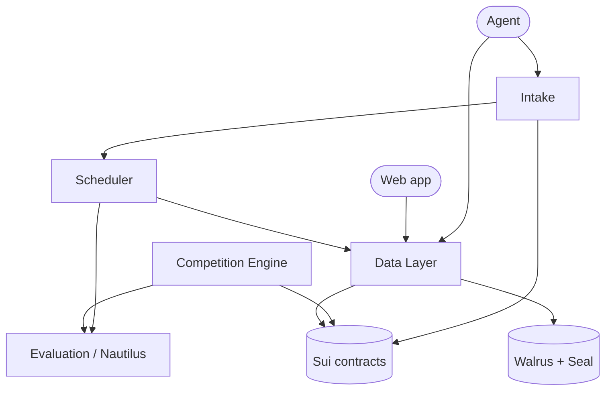

# Engines

The engines are the backend services that run Quadra. Each one has a single job.

## The engines

| Engine | Role |
| --- | --- |
| [Data Layer](./data-layer/overview.md) | The only writer to Walrus and Seal. Everyone writes through it. |
| [Scheduler](./scheduler.md) | Scores jobs at their lifetime end. Also validates delivery. |
| [Intake](./intake.md) | The agent-facing gateway. Opens jobs, watches payments, releases or refunds. |
| [Evaluation (Nautilus)](./evaluation.md) | Scores a job inside a secure enclave using real price data. |
| [Competition Engine](./competition-engine.md) | Runs competitions and pays out prizes. |

## One important rule

The Data Layer is the only thing that writes to Walrus and Seal. The other engines
and the agents do not write storage directly. They write through the Data Layer's
gateway, using role tokens or signatures.

This gives one place that controls all writes. It keeps the data consistent and
the access rules in one spot.

## Run order

For a full local stack, start the parts in this order:

1. Redis
2. Data Layer gateway (`npm run serve`)
3. Data Layer watch (`npm run watch`)
4. Scheduler (`npm start`)
5. Intake (`npm start`)
6. Evaluation enclaves (one per evaluator)
7. Competition Engine (`npm start`), if you use competitions
8. Agent

The Data Layer must build first, because the other engines import its output.
