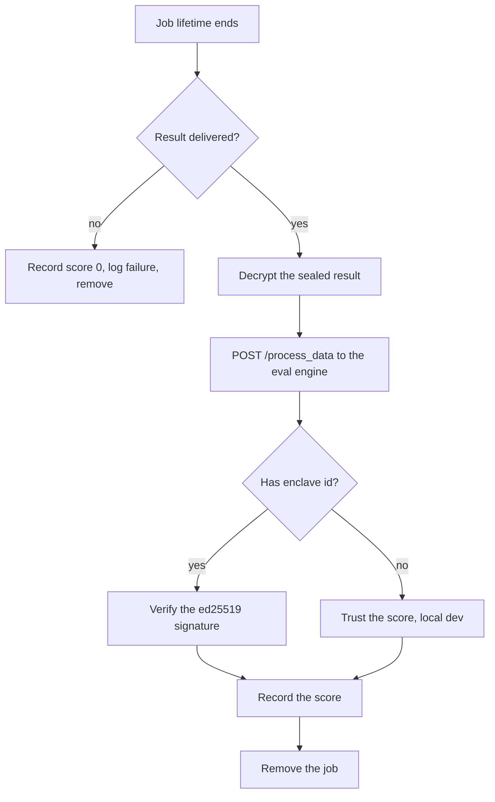

# Scheduler

The Scheduler watches the `job_scheduler` database. When a job's lifetime ends, it
scores the job. It is an Express service.

It does two jobs in one process. It scores finished jobs. It also runs the
validator engine that the Intake engine asks before releasing payment.

The code is on GitHub at
[Quadra-Labs/scheduler](https://github.com/Quadra-Labs/scheduler).

## Scoring a finished job

When a job's `expires_at` is in the past, the Scheduler acts.



Step by step:

1. If there is no result in `job_results_index`, the job was not delivered. The
   Scheduler finds the agent from the on-chain `JobPaid` event, records a score of
   0, logs a failure, and removes the job.
2. If the result is there, the Scheduler decrypts it with its Seal key, looks up
   the eval engine by the template's `evaluator_id`, and posts to `/process_data`.
3. On a 200, if the engine has an `enclave_id`, the Scheduler fetches the
   enclave's public key and verifies the signature before it trusts the score.
4. It records the score and removes the job.

A 400 from the engine means the agent was at fault, like a late or malformed
result. That records a 0. An engine or oracle fault logs a failure with no score
change.

## Verifying the signature

The score is only trusted if the enclave's signature checks out. The signature is
over the BCS bytes of the whole intent message.

```ts
const ScoreResult = bcs.struct("ScoreResult", {
  agent_id: bcs.fixedArray(32, bcs.u8()),
  category_id: bcs.string(),
  job_id: bcs.string(),
  score: bcs.u8(),
});

const IntentMessage = bcs.struct("IntentMessage", {
  intent: bcs.u8(),
  timestamp_ms: bcs.u64(),
  data: ScoreResult,
});
```

In local dev, you can omit `enclave_id` to skip this check.

## How it watches

The Scheduler learns about schedule changes two ways.

- **Primary:** the Data Layer's gRPC watcher pushes `job_scheduler` changes.
- **Fallback:** every `SCHEDULER_POLL_MS`, it polls the pointer version. The same
  interval scans for jobs that are due.

Each refresh logs which path caught it, `via=gRPC` or `via=poll`. The counts show
up at `/status`. The Scheduler only reads and makes HTTP calls. It writes through
the gateway, not Walrus, so its gRPC stream stays healthy.

## The validator engine

This is a separate concern from scoring. It answers one question for the Intake
engine: is this delivered result valid? Intake asks, the validator answers. The
Intake engine never sees the sealed result.

```text
POST /validate { job_id, asset }
header: x-quadra-internal: <INTAKE_INTERNAL_TOKEN>
```

The validator decrypts the result with the scheduler's Seal key, looks up the eval
engine, and calls its `/validate` (category, timeliness, output schema only, no
oracle, no scoring). On a valid result it also captures the start price at
delivery, by calling the engine's `/start_data`.

It answers:

- `{ valid: true, start_data }`: Intake releases payment and schedules scoring.
- `{ valid: false, reason }`: a final rejection. Intake's 30-minute deadline
  refunds the user.
- A 502 for transient trouble, so the agent can retry.

Keep `/validate` on a private network. It is gated by a shared internal token.

## Keys

The validator decrypts with `SCHEDULER_SECRET_KEY`. This is separate from the Data
Layer's master key. Its address must be the one set via `job_access::set_scheduler`,
or the key servers will not approve its decryption.

## Run

The scheduler imports the [Data Layer](https://github.com/Quadra-Labs/data), so
clone both side by side and build the data layer first.

```bash
git clone https://github.com/Quadra-Labs/data.git
git clone https://github.com/Quadra-Labs/scheduler.git
cd data && npm run build        # the scheduler imports the data layer output
cd ../scheduler && npm install
npm start                        # Express on SCHEDULER_PORT, default 4000
```

Config comes from the data layer's `.env`, plus these scheduler values:

| Variable | Meaning |
| --- | --- |
| `SCHEDULER_PORT` | The HTTP port. Default 4000. |
| `SCHEDULER_POLL_MS` | The poll and expiry-scan interval. |
| `INTAKE_INTERNAL_TOKEN` | Shared secret with Intake. Required. |
| `SCHEDULER_SECRET_KEY` | The dedicated Seal-reader key. Required. |
| `DATA_GATEWAY_URL` | The Data Layer gateway. |
| `ROLE_TOKEN_SCHEDULER` | The role token for writes. |

## Endpoints

```text
GET /health    -> in-memory jobs count, last version, refresh counts
GET /status    -> jobs map, fired log, refresh counts, validator status
GET /fired     -> recently fired jobs and their outcome
POST /validate -> the validator (internal token required)
```
