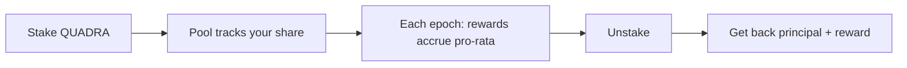

# Staking

You can stake `$QUADRA` to earn rewards. This page explains how it works and shows
the functions you call. The staking contract is on GitHub at
[Quadra-Labs/contracts](https://github.com/Quadra-Labs/contracts).

## How rewards work

Rewards use a pro-rata accumulator. This is the same pattern as MasterChef. It is
safe against flash-staking, where someone stakes for one second to grab a big
reward.

The admin sets `emission_per_epoch`. That is the total reward handed out each
epoch. It is split across all stakers by their share of the pool.

The math uses fixed-point with a precision of `1e12`, so small shares do not lose
rewards to rounding.

```move
const ACC_PRECISION: u128 = 1_000_000_000_000; // 1e12
```

There is no lock period. You can unstake whenever you want.

## The flow



## Stake

You give the pool a `$QUADRA` coin. You get back a `Stake` object. That object is
your receipt. Keep it safe, because you need it to unstake.

```move
public fun stake(
    pool: &mut StakingPool, coins: Coin<QUADRA>, ctx: &mut TxContext,
): Stake
```

There is also `stake_and_keep`, which stakes and transfers the `Stake` object to
you in one call.

## Unstake

You give back your `Stake` object. You get one `$QUADRA` coin with your principal
plus your reward.

```move
public fun unstake(
    pool: &mut StakingPool, stake: Stake, ctx: &mut TxContext,
): Coin<QUADRA>
```

The reward is capped by what is in the reward reserve. If the reserve is empty,
you still get your full principal back.

## Admin functions

These need the `StakingAdminCap`. The admin holds it.

Add tokens to the reward reserve:

```move
public fun fund_rewards(_: &StakingAdminCap, pool: &mut StakingPool, coins: Coin<QUADRA>)
```

Set how many tokens are emitted each epoch:

```move
public fun set_emission(
    _: &StakingAdminCap, pool: &mut StakingPool, emission_per_epoch: u64, ctx: &TxContext,
)
```

When the emission changes, the pool updates the accumulator first. So the old rate
applies to the epochs that already passed, and the new rate applies going forward.
